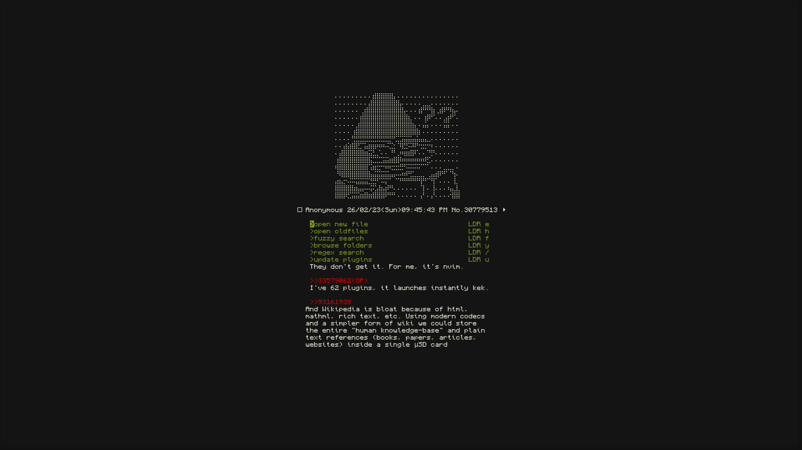
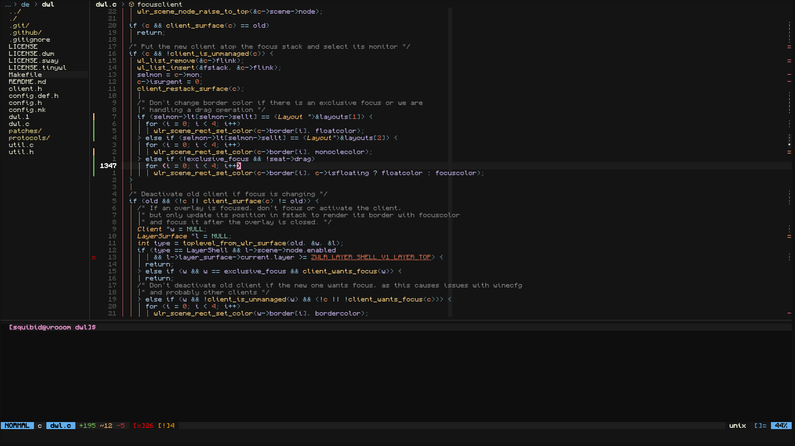

# muh neovim config

#### some goals for my config:
- reduce the use of nerdfonts
- keep as simple as possible without losing functionality

## screenshots

## plugins

click me to view the plugins that are currently in muh config

  - [essentials](https://github.com/tamton-aquib/essentials.nvim)
  - [alpha-nvim](https://github.com/goolord/alpha-nvim)
  - [nvim-scrollbar](https://github.com/petertriho/nvim-scrollbar)
  - [nvim-tetris](https://github.com/alec-gibson/nvim-tetris)
  - [duckytype](https://github.com/kwakzalver/duckytype.nvim)
  - [modicator](https://github.com/melkster/modicator.nvim)
  - [murmur](https://github.com/nyngwang/murmur.lua)
  - [pantran](https://github.com/potamides/pantran.nvim)
  - [jellybeans-nvim](https://github.com/metalelf0/jellybeans-nvim)
  - [lush.nvim](https://github.com/rktjmp/lush.nvim)
  - [lualine.nvim](https://github.com/nvim-lualine/lualine.nvim)
  - [barbacue.nvim](https://github.com/utilyre/barbecue.nvim)
  - [nvim-navic](https://github.com/SmiteshP/nvim-navic)
  - [indent-blankline.nvim](https://github.com/lukas-reineke/indent-blankline.nvim)
  - [gitsigns.nvim](https://github.com/lewis6991/gitsigns.nvim)
  - [marks.nvim](https://github.com/chentoast/marks.nvim)
  - [which-key.nvim](https://github.com/folke/which-key.nvim)
  - [smart-splits](https://github.com/mrjones2014/smart-splits.nvim)
  - [bufresize](https://github.com/kwkarlwang/bufresize.nvim)
  - [nvim-notify](https://github.com/rcarriga/nvim-notify)
  - [cosmic-ui](https://github.com/CosmicNvim/cosmic-ui)
  - [nui.nvim](https://github.com/MunifTanjim/nui.nvim)
  - [telescope.nvim](https://github.com/nvim-telescope/telescope.nvim)
  - [telescope-file-browser.nvim](https://github.com/nvim-telescope/telescope-file-browser.nvim)
  - [telescope-ui-select.nvim](https://github.com/nvim-telescope/telescope-ui-select.nvim)
  - [plenary.nvim](https://github.com/nvim-lua/plenary.nvim)
  - [telescope-undo.nvim](https://github.com/debugloop/telescope-undo.nvim)
  - [nvim-neoclip.lua](https://github.com/AckslD/nvim-neoclip.lua)
  - [intellitab.nvim](https://github.com/pta2002/intellitab.nvim)
  - [comment.nvim](https://github.com/numToStr/Comment.nvim)
  - [trouble.nvim](https://github.com/folke/trouble.nvim)
  - [todo-comments.nvim](https://github.com/folke/todo-comments.nvim)
  - [toggleterm.nvim](https://github.com/akinsho/toggleterm.nvim)
  - [diffview.nvim](https://github.com/sindrets/diffview.nvim)
  - [nvim-rooter.lua](https://github.com/notjedi/nvim-rooter.lua)
  - [venn.nvim](https://github.com/jbyuki/venn.nvim)
  - [neorg](https://github.com/nvim-neorg/neorg)
  - [true-zen.nvim](https://github.com/loqusion/true-zen.nvim)
  - [high-str.nvim](https://github.com/Pocco81/high-str.nvim)
  - [nvim-treesitter](https://github.com/nvim-treesitter/nvim-treesitter)
  - [hlargs](https://github.com/m-demare/hlargs.nvim)
  - [treesj](https://github.com/Wansmer/treesj)
  - [hover.nvim](https://github.com/lewis6991/hover.nvim)
  - [nvim-colorizer.lua](https://github.com/nvchad/nvim-colorizer.lua)
  - [lsp-zero.nvim](https://github.com/VonHeikemen/lsp-zero.nvim)
  - [nvim-cmp](https://github.com/hrsh7th/nvim-cmp)
  - [cmp-buffer](https://github.com/hrsh7th/cmp-buffer)
  - [cmp-path](https://github.com/hrsh7th/cmp-path)
  - [cmp-calc](https://github.com/hrsh7th/cmp-calc)
  - [cmp_luasnip](https://github.com/saadparwaiz1/cmp_luasnip)
  - [cmp-nvim-lua](https://github.com/hrsh7th/cmp-nvim-lua)
  - [cmp-nvim-lsp](https://github.com/hrsh7th/cmp-nvim-lsp)
  - [cmp-under-comparator](https://github.com/lukas-reineke/cmp-under-comparator)
  - [lspkind.nvim](https://github.com/onsails/lspkind.nvim)
  - [LuaSnip](https://github.com/L3MON4D3/LuaSnip)
  - [friendly-snippets](https://github.com/rafamadriz/friendly-snippets)
  - [cmp-luasnip-choice](https://github.com/doxnit/cmp-luasnip-choice)
  - [nvim-lspconfig](https://github.com/neovim/nvim-lspconfig)
  - [mason.nvim](https://github.com/williamboman/mason.nvim)
  - [mason-lspconfig.nvim](https://github.com/williamboman/mason-lspconfig.nvim)
  - [nvim-autopairs](https://github.com/windwp/nvim-autopairs)

PS: sry about the kitchen sink commits, I just learned about `git add --patch`
